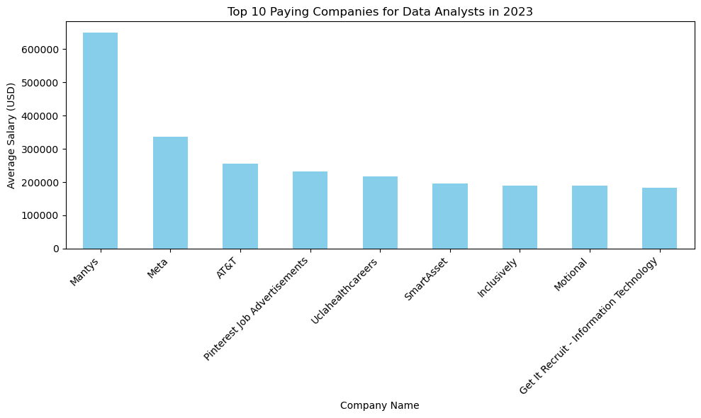

# SQL_Project_Data_Job_Analysis
A comprehensive analysis of the data job market
# Introduction
This repository provides an in-depth analysis of the data job market, with a specific focus on data analyst roles. It includes insights into the highest-paying positions, the most in-demand skills, and explores the critical areas where high demand aligns with lucrative salaries in the field of data analytics. Whether you're a data professional or aspiring to enter the field, this project offers valuable information to help you navigate and excel in the competitive data job market.

SQL queries? Check them out here [Data Job Analysis](/ /)
# Background
This project was created to better understand and navigate the data analyst job market by identifying the highest-paying roles and the most in-demand skills, aiming to simplify the job search process for others.The data includes valuable information on job titles, salaries, locations, and key skills.

## Through SQL queries, I sought to answer the following questions:

Which data analyst jobs offer the highest salaries?
What skills are required for these high-paying roles?
Which skills are most in demand for data analysts?
Which skills correlate with higher salaries?
What are the most essential skills to learn?

# Tools Utilized
To thoroughly explore the data analyst job market, I relied on several essential tools:
* ### SQL
* ### PostgreSQL
* ### Visual Studio Code
* ### Github

# The Analysis
## 1. Top paying Data Analyst jobs

```sql
SELECT
    job_id,
    job_title,
    job_location,
    job_schedule_type,
    salary_year_avg,
    job_posted_date,
    name AS company_name
FROM
    job_postings_fact
LEFT JOIN company_dim ON job_postings_fact.company_id=company_dim.company_id
WHERE
    job_title_short='Data Analyst' AND
    job_location='Anywhere' AND
    salary_year_avg IS NOT NULL
ORDER BY
    salary_year_avg DESC
LIMIT 10
```
## Insights on the Top 10 Paying Data Analyst Jobs in 2023

### 1. Top Paying Companies:

- **Mantys** leads with an impressive average salary of $650,000 for data analyst positions.
- **Meta** follows with an average salary of $336,500.
- Other notable companies include AT&T with $255,829.5, Pinterest Job Advertisements with $232,423, and Uclahealthcareers offering $217,000.
### 2. Salary Distribution:
- The average salaries among the top companies vary significantly, from $184,000 at Get It Recruit - Information Technology to $650,000 at Mantys.
- The distribution shows a steep decline from the highest-paying company, suggesting that only a few companies offer exceptionally high salaries, while others are relatively lower but still competitive.
### 3. Notable Trends:
- Companies like **Meta** and **AT&T**, which are known for their large-scale operations, offer strong average salaries, reflecting their ability to compensate top talent in the field.
- **Mantys** stands out with a remarkably high average salary, which might be indicative of either a high-demand, specialized role or an outlier in the dataset.



## 2. Skills for Top Paying Jobs
To understand what skills are required for the top-paying jobs, I joined the job postings with the skills data, providing insights into what employers value for high-compensation roles.
```sql
WITH top_paaying_jobs AS(
    SELECT
        job_id,
        job_title,
        salary_year_avg,
        name AS company_name
    FROM
        job_postings_fact
    LEFT JOIN company_dim ON job_postings_fact.company_id=company_dim.company_id
    WHERE
        job_title_short='Data Analyst' AND
        job_location='Anywhere' AND
        salary_year_avg IS NOT NULL
    ORDER BY
        salary_year_avg DESC
    LIMIT 10
)
```
