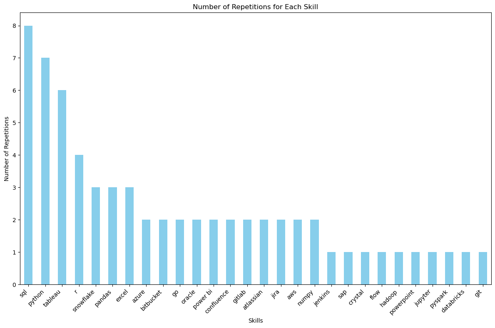

# SQL_Project_Data_Job_Analysis
A comprehensive analysis of the data job market
# Introduction
This repository provides an in-depth analysis of the data job market, with a specific focus on data analyst roles. It includes insights into the highest-paying positions, the most in-demand skills, and explores the critical areas where high demand aligns with lucrative salaries in the field of data analytics. Whether you're a data professional or aspiring to enter the field, this project offers valuable information to help you navigate and excel in the competitive data job market.

SQL queries? Check them out here [Data Job Analysis](/ /)
# Background
This project was created to better understand and navigate the data analyst job market by identifying the highest-paying roles and the most in-demand skills, aiming to simplify the job search process for others.The data includes valuable information on job titles, salaries, locations, and key skills.

## Through SQL queries, I sought to answer the following questions:

Which data analyst jobs offer the highest salaries?
What skills are required for these high-paying roles?
Which skills are most in demand for data analysts?
Which skills correlate with higher salaries?
What are the most essential skills to learn?

# Tools Utilized
To thoroughly explore the data analyst job market, I relied on several essential tools:
* ### SQL
* ### PostgreSQL
* ### Visual Studio Code
* ### Github

# The Analysis
## 1. Top paying Data Analyst jobs

```sql
SELECT
    job_id,
    job_title,
    job_location,
    job_schedule_type,
    salary_year_avg,
    job_posted_date,
    name AS company_name
FROM
    job_postings_fact
LEFT JOIN company_dim ON job_postings_fact.company_id=company_dim.company_id
WHERE
    job_title_short='Data Analyst' AND
    job_location='Anywhere' AND
    salary_year_avg IS NOT NULL
ORDER BY
    salary_year_avg DESC
LIMIT 10
```
## Insights on the Top 10 Paying Data Analyst Jobs in 2023

### 1. Top Paying Companies:

- **Mantys** leads with an impressive average salary of $650,000 for data analyst positions.
- **Meta** follows with an average salary of $336,500.
- Other notable companies include AT&T with $255,829.5, Pinterest Job Advertisements with $232,423, and Uclahealthcareers offering $217,000.
### 2. Salary Distribution:
- The average salaries among the top companies vary significantly, from $184,000 at Get It Recruit - Information Technology to $650,000 at Mantys.
- The distribution shows a steep decline from the highest-paying company, suggesting that only a few companies offer exceptionally high salaries, while others are relatively lower but still competitive.
### 3. Notable Trends:
- Companies like **Meta** and **AT&T**, which are known for their large-scale operations, offer strong average salaries, reflecting their ability to compensate top talent in the field.
- **Mantys** stands out with a remarkably high average salary, which might be indicative of either a high-demand, specialized role or an outlier in the dataset.


## 2. Skills for Top Paying Jobs
To understand what skills are required for the top-paying jobs, I joined the job postings with the skills data, providing insights into what employers value for high-compensation roles.
```sql
WITH top_paaying_jobs AS(
    SELECT
        job_id,
        job_title,
        salary_year_avg,
        name AS company_name
    FROM
        job_postings_fact
    LEFT JOIN company_dim ON job_postings_fact.company_id=company_dim.company_id
    WHERE
        job_title_short='Data Analyst' AND
        job_location='Anywhere' AND
        salary_year_avg IS NOT NULL
    ORDER BY
        salary_year_avg DESC
    LIMIT 10
)
```
## Insights on most demanded skills for the top 10 highest paying data analyst jobs in 2023

1. **Top Skills**:
   - **SQL** is the most frequently mentioned skill, appearing 8 times in the dataset. This indicates a high demand or prevalence of SQL skills for the job positions in this dataset.
   - **Python** is also highly demanded, appearing 7 times, making it a critical skill for these roles.

2. **Data Tools and Technologies**:
   - **Tableau** (6 mentions) and **Snowflake** (3 mentions) suggest a strong focus on data visualization and cloud-based data warehousing tools.
   - **Excel** (3 mentions) remains a popular tool, despite the presence of more advanced data tools.

3. **Programming Languages**:
   - Apart from Python, **R** (4 mentions) and **Go** (2 mentions) are other notable programming languages required, indicating diverse programming needs across different roles.

4. **Cloud and DevOps**:
   - **Azure** (2 mentions) and **AWS** (2 mentions) highlight the need for cloud computing skills.
   - Tools like **Bitbucket**, **GitLab**, **Jenkins**, and **Git** suggest that version control and CI/CD pipelines are important in these roles.

5. **Collaborative and Project Management Tools**:
   - Tools like **Confluence**, **Jira**, and **Atlassian** (each with 2 mentions) suggest that collaboration and project management tools are essential in these roles.

6. **Less Frequent but Specialized Skills**:
   - Skills like **Hadoop**, **PySpark**, and **Databricks** appear only once, indicating that they might be required for specific roles or projects.

### Overall Insights:
- The analysis shows a strong emphasis on data analysis, data engineering, and cloud computing skills, with SQL, Python, and Tableau leading the pack.
- There's a significant demand for tools and technologies that support data management, visualization, and cloud-based solutions.
- The presence of collaboration and DevOps tools highlights the importance of teamwork and continuous integration in these roles.
- The diversity in skills also suggests that candidates need a mix of programming, data handling, and project management skills to be competitive in these roles.



## 3. High-Demand Skills for Data Analysts
This analysis highlighted the most commonly requested skills in job postings, emphasizing areas with significant demand.

```sql
SELECT 
    skills,
    COUNT(skills_job_dim.job_id) AS demand_count
FROM job_postings_fact
INNER JOIN skills_job_dim ON job_postings_fact.job_id = skills_job_dim.job_id
INNER JOIN skills_dim ON skills_job_dim.skill_id = skills_dim.skill_id
WHERE
    job_title_short='Data Analyst'
GROUP BY
    skills
ORDER BY
    demand_count DESC
LIMIT 5
```
## Insights on the Top 5 Most Demanded Skills for Data Analysts:

1. **SQL Leads the Demand:**
SQL is the most sought-after skill, with 92,628 job postings mentioning it. This underscores the critical importance of SQL for data analysts, as it's a fundamental tool for querying and managing databases.

2. **Excel Remains Vital:**
Despite the rise of more advanced tools, Excel still appears in 67,031 job postings, making it the second most demanded skill. This reflects Excel's continued relevance in data analysis for tasks like data manipulation, reporting, and visualization.

3. **Python's Growing Popularity:**
Python is mentioned in 57,326 job postings, ranking third. Its high demand highlights its versatility in data analysis, including data wrangling, statistical analysis, and machine learning.

4. **Visualization Tools are Key:**
Both Tableau and Power BI are highly demanded, with 46,554 and 39,468 mentions, respectively. This indicates that data visualization and dashboard creation are crucial skills for data analysts, allowing them to present data insights effectively.

5. **Versatility and Diverse Skillset:**
The top five skills cover a broad spectrum, from database management (SQL) and data manipulation (Excel) to programming (Python) and data visualization (Tableau, Power BI). This suggests that data analysts need a well-rounded skill set that includes technical, analytical, and presentation capabilities to meet the demands of the job market.

### Overall Insight:
The data reveals that employers prioritize a combination of traditional and modern tools, with SQL and Excel as foundational skills, while Python and visualization tools like Tableau and Power BI are increasingly essential for more advanced data analysis tasks.

Here is the table showing the demand for the top 5 skills in data analyst job postings:

| **Skill**   | **Demand Count** |
|-------------|------------------|
| SQL         | 92,628           |
| Excel       | 67,031           |
| Python      | 57,326           |
| Tableau     | 46,554           |
| Power BI    | 39,468           |

4. ## Skills and Salary Analysis
Examining the average salaries tied to various skills highlighted which ones offer the highest pay.

```sql
SELECT 
    skills,
    ROUND(AVG(salary_year_avg), 0) AS average_salary
FROM job_postings_fact
INNER JOIN skills_job_dim ON job_postings_fact.job_id = skills_job_dim.job_id
INNER JOIN skills_dim ON skills_job_dim.skill_id = skills_dim.skill_id
WHERE
    job_title_short='Data Analyst' AND
    salary_year_avg IS NOT NULL
GROUP BY
    skills
ORDER BY
    average_salary DESC
LIMIT 25
```
### Insights on the Top 25 Highest-Paying Skills:

1. **High-Value Niche Skills**:
   - **SVN (Subversion)** stands out with an exceptionally high average salary of **$400,000**. This suggests that expertise in SVN, though less commonly mentioned compared to other version control systems, is highly valued, possibly due to its use in specialized or legacy systems.

2. **Blockchain and Emerging Technologies**:
   - **Solidity**, a programming language for smart contracts on blockchain platforms, ranks second with an average salary of **$179,000**. This indicates the lucrative opportunities available in blockchain and decentralized technologies.

3. **Specialized Databases and Tools**:
   - **Couchbase** (**$160,515**), a NoSQL database, and **DataRobot** (**$155,486**), an automated machine learning platform, also command high salaries. These tools cater to specialized needs, such as big data management and AI-driven analytics, reflecting their importance in advanced data projects.

4. **Programming Languages and Frameworks**:
   - **Golang (Go)**, with an average salary of **$155,000**, is the highest-paying programming language on this list, highlighting its demand for building high-performance, scalable applications.
   - Other machine learning frameworks like **MXNet** (**$149,000**), **Keras** (**$127,013**), **PyTorch** (**$125,226**), and **TensorFlow** (**$120,647**) are also highly paid, showing the value of deep learning and AI skills.

5. **DevOps and Cloud Tools**:
   - Tools like **VMware** (**$147,500**), **Terraform** (**$146,734**), **GitLab** (**$134,126**), **Ansible** (**$124,370**), and **Puppet** (**$129,820**) are associated with high salaries, reflecting the growing importance of DevOps practices in modern IT environments.
   - The presence of cloud infrastructure tools such as **Terraform** and **VMware** further emphasizes the high value placed on skills related to cloud computing and infrastructure as code.

6. **AI and ML Platforms**:
   - AI and machine learning skills are consistently well-compensated, with tools like **Hugging Face** (**$123,950**) and **Airflow** (**$116,387**) also appearing on the list, indicating the premium placed on AI-driven solutions and orchestration tools.

7. **Legacy and Versatile Tools**:
   - **Perl** (**$124,686**) and **Scala** (**$115,480**) show that even older or less mainstream programming languages can command high salaries, especially when they are integral to specific projects or industries.

### Overall Insight:
The data suggests that niche, specialized, and emerging technologies tend to command the highest salaries. Skills in blockchain, advanced data management, AI/ML frameworks, and DevOps tools are particularly lucrative, indicating that professionals with expertise in these areas are in high demand. Additionally, the presence of both legacy and cutting-edge technologies on this list highlights the value of both deep specialization and versatility in the tech industry.

Here is the table showing the average salary for the top 25 highest-paying skills for data analysts:

| **Skill**       | **Average Salary** |
|-----------------|--------------------|
| SVN             | $400,000           |
| Solidity        | $179,000           |
| Couchbase       | $160,515           |
| DataRobot       | $155,486           |
| Golang          | $155,000           |
| MXNet           | $149,000           |
| dplyr           | $147,633           |
| VMware          | $147,500           |
| Terraform       | $146,734           |
| Twilio          | $138,500           |
| GitLab          | $134,126           |
| Kafka           | $129,999           |
| Puppet          | $129,820           |
| Keras           | $127,013           |
| PyTorch         | $125,226           |
| Perl            | $124,686           |
| Ansible         | $124,370           |
| Hugging Face    | $123,950           |
| TensorFlow      | $120,647           |
| Cassandra       | $118,407           |
| Notion          | $118,092           |
| Atlassian       | $117,966           |
| Bitbucket       | $116,712           |
| Airflow         | $116,387           |
| Scala           | $115,480           |

5. ## Ideal Skills for Learning
This analysis combines insights from demand and salary data to pinpoint skills that are both in high demand and well-compensated, offering a strategic guide for skill development.
```sql
WITH skill_demand AS (
    SELECT 
        skills_dim.skill_id,
        skills_dim.skills,
        COUNT(skills_job_dim.job_id) AS demand_count
    FROM job_postings_fact
    INNER JOIN skills_job_dim ON job_postings_fact.job_id = skills_job_dim.job_id
    INNER JOIN skills_dim ON skills_job_dim.skill_id = skills_dim.skill_id
    WHERE
        job_title_short='Data Analyst' AND
        job_work_from_home = TRUE AND
        salary_year_avg IS NOT NULL
    GROUP BY
        skills_dim.skill_id
), average_salary AS(
SELECT 
    skills_job_dim.skill_id,
    ROUND(AVG(salary_year_avg), 0) AS average_salary
FROM job_postings_fact
INNER JOIN skills_job_dim ON job_postings_fact.job_id = skills_job_dim.job_id
INNER JOIN skills_dim ON skills_job_dim.skill_id = skills_dim.skill_id
WHERE
    job_title_short='Data Analyst' AND
    salary_year_avg IS NOT NULL AND
    job_work_from_home = TRUE
GROUP BY
    Skills_job_dim.skill_id
)

SELECT
    skill_demand.skill_id,
    skill_demand.skills,
    demand_count,
    average_salary
FROM skill_demand
INNER JOIN average_salary ON skill_demand.skill_id=average_salary.skill_id
WHERE
    demand_count>10
ORDER BY 
    average_salary DESC,
    demand_count DESC
LIMIT 25
```
Here's a formatted version of the data you provided:

| skill_id | skills      | demand_count | average_salary |
|----------|-------------|--------------|----------------|
| 8        | go          | 27           | 115,320        |
| 234      | confluence  | 11           | 114,210        |
| 97       | hadoop      | 22           | 113,193        |
| 80       | snowflake   | 37           | 112,948        |
| 74       | azure       | 34           | 111,225        |
| 77       | bigquery    | 13           | 109,654        |
| 76       | aws         | 32           | 108,317        |
| 4        | java        | 17           | 106,906        |
| 194      | ssis        | 12           | 106,683        |
| 233      | jira        | 20           | 104,918        |
| 79       | oracle      | 37           | 104,534        |
| 185      | looker      | 49           | 103,795        |
| 2        | nosql       | 13           | 101,414        |
| 1        | python      | 236          | 101,397        |
| 5        | r           | 148          | 100,499        |
| 78       | redshift    | 16           | 99,936         |
| 187      | qlik        | 13           | 99,631         |
| 182      | tableau     | 230          | 99,288         |
| 197      | ssrs        | 14           | 99,171         |
| 92       | spark       | 13           | 99,077         |
| 13       | c++         | 11           | 98,958         |
| 186      | sas         | 63           | 98,902         |
| 7        | sas         | 63           | 98,902         |
| 61       | sql server  | 35           | 97,786         |
| 9        | javascript  | 20           | 97,587         |

This table lists various skills, their corresponding demand counts, and average salaries.

### Insights on the Optimal Skills:

### 1. **High-Demand Skills with Competitive Salaries**:
   - **Python** (236 demand count, $101,397 average salary): Python stands out as the most demanded skill, making it essential for data analysts aiming for broad market applicability.
   - **Tableau** (230 demand count, $99,288 average salary): Similar to Python, Tableau is highly demanded, emphasizing the importance of data visualization skills in the industry.
   - **R** (148 demand count, $100,499 average salary): R is another key programming language in demand, particularly in statistical analysis and data science.

### 2. **High-Paying Skills**:
   - **Go** ($115,320 average salary, 27 demand count): Go offers the highest average salary among the listed skills, though it has moderate demand. It may represent niche but lucrative opportunities.
   - **Confluence** ($114,210 average salary, 11 demand count): While Confluence is not in high demand, it commands a high average salary, indicating specialized roles that require this skill.
   - **Hadoop** ($113,193 average salary, 22 demand count): Hadoop is well-compensated and remains important for big data processing.

### 3. **Balanced Skills (High Demand and High Salary)**:
   - **Snowflake** ($112,948 average salary, 37 demand count): Snowflake combines a solid salary with decent demand, making it a valuable skill for data analysts focused on cloud data warehousing.
   - **Azure** ($111,225 average salary, 34 demand count) and **AWS** ($108,317 average salary, 32 demand count): Both cloud computing platforms are in demand and offer competitive salaries, indicating the growing importance of cloud services in data analytics.

### 4. **Moderate Demand with Competitive Salaries**:
   - **Looker** ($103,795 average salary, 49 demand count): Looker is in moderately high demand and offers a good salary, suggesting it's a valuable tool for data visualization and analytics.
   - **SQL Server** ($97,786 average salary, 35 demand count): SQL Server is a staple in data management, with consistent demand and a solid salary.

### 5. **Emerging and Niche Skills**:
   - **BigQuery** (13 demand count, $109,654 average salary): Though not as widely demanded, BigQuery’s salary suggests it is valued in specific roles, likely related to cloud-based data analysis.

### **Strategic Takeaways**:
- **Focus on Learning Python, Tableau, and R**: These skills are in high demand and also offer decent salaries, making them essential for most data analyst roles.
- **Specialize in Go, Confluence, or Snowflake**: These skills might lead to higher-paying positions, particularly in specialized or niche roles.
- **Develop Cloud Skills**: Azure and AWS, with their high demand and salary potential, indicate that cloud computing skills are becoming increasingly crucial in the data analytics field.

# Conclusion

This project provides a thorough examination of the data analyst job market in 2023, offering valuable insights into the highest-paying roles and the most sought-after skills. The analysis reveals that while SQL, Python, and Tableau continue to dominate the demand landscape, niche technologies like Go, Snowflake, and blockchain-related skills command some of the highest salaries. The findings underscore the importance of a well-rounded skill set that combines traditional data analysis tools with emerging technologies and cloud computing skills. For professionals in the field, strategically focusing on these high-demand and high-salary skills can significantly enhance career prospects and align them with lucrative opportunities in the evolving data job market.

Overall, a strategic combination of mastering in-demand tools like Python and Tableau, along with specialized skills like Snowflake or Go, can lead to lucrative career opportunities in data analytics.
